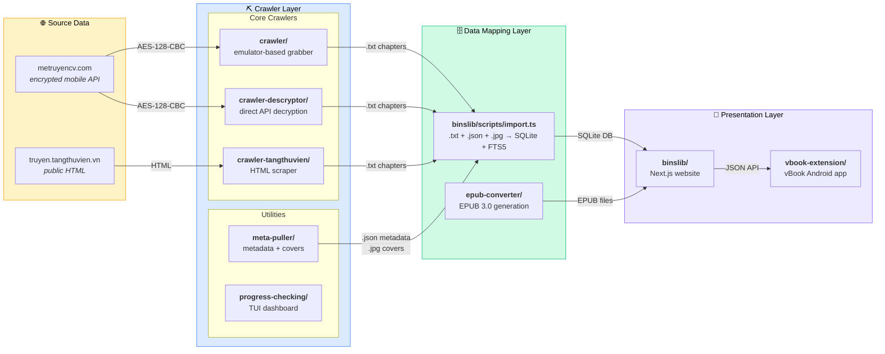

# MTC

A multi-source Vietnamese web novel platform: crawling, decryption, conversion, and self-hosted reading. Downloads books from [metruyencv.com](https://metruyencv.com) and [truyen.tangthuvien.vn](https://truyen.tangthuvien.vn), converts them to EPUB, and serves them through a web reader at [lib.binscode.site](https://lib.binscode.site).

## Architecture

The system is organized into four layers, each feeding into the next:



### Layer details

**Source data** — Two upstream sites provide the raw content. MTC exposes an Android mobile API that returns AES-128-CBC encrypted chapter text (key embedded at `[17:33]` in the response). TTV serves public HTML pages.

**Crawler layer** — Three crawlers produce the same output format: plain `.txt` chapter files under `output/{book_id}/`. `crawler/` automates an Android emulator to bypass MTC encryption. `crawler-descryptor/` decrypts the MTC API directly (preferred). `crawler-tangthuvien/` scrapes TTV HTML. Supporting utilities: `meta-puller/` fetches book metadata and cover images as `.json`/`.jpg`, and `progress-checking/` provides a real-time TUI dashboard.

**Data mapping layer** — `binslib/scripts/import.ts` scans all crawler output directories, reads `.txt` chapters, `.json` metadata, and `.jpg` covers, then inserts everything into a SQLite database with FTS5 full-text search indexes. Each book is tagged with a `source` column (`mtc` or `ttv`). `epub-converter/` also operates at this layer, generating EPUB 3.0 files from the stored chapter data for download through binslib.

**Presentation layer** — `binslib/` is a Next.js web app serving the catalog, reader, search, rankings, and on-demand EPUB downloads. `vbook-extension/` is a JavaScript extension for the [vBook](https://github.com/AaronLee01/vbook) Android reading app that communicates with binslib via JSON APIs.

## Subprojects

| Directory              | Layer        | Language    | Purpose                                |
| ---------------------- | ------------ | ----------- | -------------------------------------- |
| `crawler/`             | Crawler      | Python 3.9+ | Emulator-based book grabber (MTC)      |
| `crawler-descryptor/`  | Crawler      | Python 3.9+ | Direct API decryption (MTC, preferred) |
| `crawler-tangthuvien/` | Crawler      | Python 3.9+ | HTML scraper (TTV)                     |
| `meta-puller/`         | Crawler util | Python 3.9+ | Book metadata + cover images           |
| `progress-checking/`   | Crawler util | Python 3.9+ | Real-time TUI dashboard (rich)         |
| `epub-converter/`      | Mapping      | Python 3.12 | .txt → EPUB 3.0 conversion (Docker)    |
| `binslib/`             | Mapping + UI | TypeScript  | Importer, Next.js web reader, catalog  |
| `vbook-extension/`     | UI           | JavaScript  | vBook Android app extension            |

## Quick Start

### Download books (API-based, preferred)

```bash
cd crawler-descryptor/
pip install -r requirements.txt
python3 main.py fetch-book <book_id>        # single book
python3 batch_download.py                    # batch download
python3 download_top1000.py -w 100           # top ranked books, 100 workers
```

### [DEPRECATED] Download books (emulator-based, macOS only)

```bash
cd crawler/
./start_emulators.sh
python3 grab_book.py "book name"             # single book end-to-end
python3 parallel_grab.py                     # dual-emulator parallel download
```

### Download books (tangthuvien)

```bash
cd crawler-tangthuvien/
pip install -r requirements.txt
python3 discover.py --pages 50               # scrape book listings
python3 batch_download.py -w 3               # download discovered books
```

### Enrich metadata + generate EPUBs

```bash
cd meta-puller/
python3 pull_metadata.py                     # fetch covers, authors, genres

cd ../epub-converter/
docker compose run --rm epub-converter       # convert all books to EPUB
```

### Run the web reader

```bash
cd binslib/
npm install
npm run db:migrate
npm run import:full                          # import all crawler output
npm run dev                                  # http://localhost:3000
```

### Docker deployment

```bash
cd binslib/
docker compose up -d
docker compose logs -f binslib-importer
```

## Technical Details

### Crawler output format (shared)

```
{crawler}/output/{book_id}/
├── book.json           # book metadata (or metadata.json)
├── cover.jpg           # cover image (from meta-puller)
├── 0001_slug.txt       # individual chapters
└── Book Name.txt       # combined full book
```

TTV books use a 10M+ ID offset to avoid collision with MTC book IDs. The `source` column in the database (`mtc` or `ttv`) provides explicit source tracking.

### MTC encryption

The mobile API returns AES-128-CBC encrypted content in a Laravel envelope. The key is embedded at positions `[17:33]` within the encrypted response itself. See `crawler-descryptor/src/decrypt.py`.

### Binslib stack

- Next.js 15 App Router with SSR and Turbopack
- SQLite + Drizzle ORM + FTS5 full-text search
- NextAuth.js v5 (credentials auth)
- Tailwind CSS 4
- On-demand EPUB generation from stored chapters
- Global MTC/TTV source toggle (cookie-persisted)

## Platform Compatibility

- `crawler/` — macOS only (hardcoded ADB paths, `sips`, fork-based multiprocessing)
- `crawler-descryptor/` — cross-platform
- `crawler-tangthuvien/` — cross-platform
- `binslib/` — cross-platform (Docker or Node.js)
- `vbook-extension/` — Android (vBook app)
