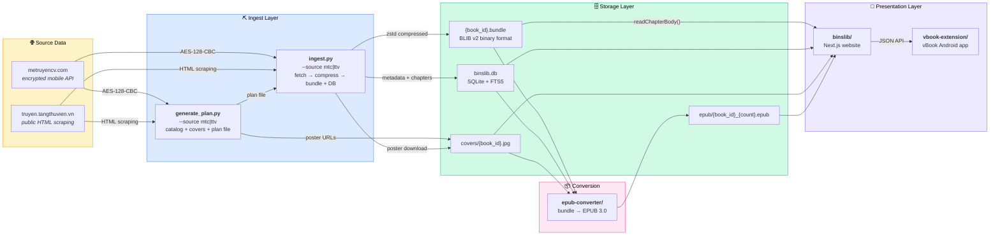

# MTC

A Vietnamese web novel platform: multi-source ingestion, compression, and self-hosted reading. Downloads books from [metruyencv.com](https://metruyencv.com) (encrypted API) and [truyen.tangthuvien.vn](https://truyen.tangthuvien.vn) (HTML scraping), converts them to EPUB, and serves them through a web reader at [lib.binscode.site](https://lib.binscode.site).

## Architecture



### Layer details

**Source data** — MTC exposes an Android mobile API that returns AES-128-CBC encrypted chapter text (key embedded at positions `[17:33]` in the response). TTV serves plain HTML pages that are scraped and parsed (no authentication or decryption required).

**Ingest layer** — Both `generate_plan.py` and `ingest.py` accept `--source mtc|ttv` to select the data source. `generate_plan.py` discovers books (MTC: API catalog pagination; TTV: HTML listing-page scraping), cross-references with local bundles, writes a download plan (`data/books_plan_mtc.json` or `data/books_plan_ttv.json`), and pulls missing cover images. `ingest.py` reads the plan and runs the full pipeline: fetch → compress (zstd + global dictionary) → write BLIB v2 bundles + SQLite, with parallel workers and checkpoint flushing. MTC chapters are decrypted (AES-128-CBC); TTV chapters are parsed from HTML. `generate_plan.py --refresh --scan` (MTC only) enriches the plan with full per-book metadata and discovers books invisible to the catalog listing endpoint.

**Storage layer** — Chapter bodies are stored in per-book `.bundle` files (BLIB v2 format with inline metadata). The SQLite database holds book/author/genre/tag metadata and chapter index rows (no bodies). Cover images are served as static files. EPUBs are cached with chapter-count-aware filenames for automatic invalidation.

**Conversion** — `epub-converter/` reads chapters from bundles (zstd decompression), metadata from SQLite, and covers from disk. EPUBs are cached at `binslib/data/epub/{book_id}_{chapter_count}.epub` and regenerated only when the chapter count increases.

**Presentation layer** — `binslib/` is a Next.js web app serving the catalog, reader, search, rankings, and on-demand EPUB downloads. `vbook-extension/` is a JavaScript extension for the vBook Android reading app.

## Subprojects

| Directory              | Layer      | Language   | Purpose                                                |
| ---------------------- | ---------- | ---------- | ------------------------------------------------------ |
| `book-ingest/`         | Ingest     | Python 3.9+| Multi-source plan generation + fetch → compress → bundle + DB |
| `meta-puller/`         | Ingest     | Python 3.9+| Cover images + catalog metadata (legacy, see `generate_plan.py`) |
| `crawler-tangthuvien/` | Ingest     | Python 3.9+| Standalone TTV HTML scraper (legacy, now integrated into `book-ingest`) |
| `epub-converter/`      | Conversion | Python 3.12| Bundle → EPUB 3.0 with chapter-count caching           |
| `binslib/`             | UI         | TypeScript | Next.js web reader, catalog, search, EPUB downloads    |
| `sync-book/`           | Ops        | Bash       | Rsync bundles + covers + DB between machines            |
| `vbook-extension/`     | UI         | JavaScript | vBook Android app extension                            |

## Quick Start

### 1. Generate the download plan

```bash
cd book-ingest/
pip install -r requirements.txt

# ── MTC (default) ────────────────────────────────────────
# Paginate API catalog, cross-ref with local bundles, pull missing covers
python3 generate_plan.py

# Enrich plan with full per-book metadata + discover hidden books
python3 generate_plan.py --refresh --scan --fix-author

# Only pull missing covers
python3 generate_plan.py --cover-only

# ── TTV ──────────────────────────────────────────────────
# Scrape TTV listing pages, cross-ref with local bundles, pull covers
python3 generate_plan.py --source ttv

# Refresh TTV plan with latest metadata
python3 generate_plan.py --source ttv --refresh

# TTV covers only
python3 generate_plan.py --source ttv --cover-only
```

### 2. Ingest books

```bash
# ── MTC (default) ────────────────────────────────────────
# Ingest from plan file with 5 parallel workers
python3 ingest.py -w 5

# Specific book IDs (bypasses plan file)
python3 ingest.py 100358 100441

# Audit mode — report gaps without downloading
python3 ingest.py --audit-only

# Update metadata only (no chapter downloads)
python3 ingest.py --update-meta-only

# ── TTV ──────────────────────────────────────────────────
# Ingest TTV books from plan
python3 ingest.py --source ttv -w 3

# Specific TTV book ID
python3 ingest.py --source ttv 10000001
```

Both sources go directly from fetch → compress → bundle + DB with no intermediate files.

### 3. Generate EPUBs (optional)

```bash
cd epub-converter/
pip install -r requirements.txt
python3 convert.py                          # convert all eligible books
python3 convert.py --ids 100358 128390      # specific books
python3 convert.py --status completed       # only completed books
```

### 4. Run the web reader

```bash
cd binslib/
npm install
npm run db:migrate                          # create tables + FTS5
npm run dev                                 # http://localhost:3000
```

### 5. Sync to remote server

```bash
cd sync-book/
./sync-bundles.sh upload                    # bundles + covers + DB
./sync-bundles.sh upload --cover-only       # covers only
./sync-bundles.sh upload --db-only          # database only
```

### Docker deployment

```bash
cd binslib/
docker compose up -d
```

## Technical Details

### MTC encryption

The mobile API returns AES-128-CBC encrypted content in a Laravel envelope. The key is embedded at positions `[17:33]` within the encrypted response itself — 16 characters whose byte values form the AES-128 key. Removing those characters yields clean base64 that decodes to a JSON envelope with `iv`, `value`, and `mac` fields. See `book-ingest/src/decrypt.py` and `book-ingest/README.md` for the full walkthrough.

### Bundle format (BLIB v2)

All chapter data for a book is stored in a single `.bundle` file. The BLIB v2 format stores a 256-byte metadata prefix (chapter_id, title, slug, word_count) before each compressed chapter block, enabling:

- **O(1) random access** to any chapter via the binary index
- **DB recovery** from bundles alone (no decompression needed for metadata)
- **O(missing) resume** via stored `chapter_id` instead of O(total) linked-list traversal

See `book-ingest/README.md` for the complete binary layout and read paths.

### Storage layout

```
book-ingest/
├── data/
│   ├── books_plan_mtc.json     # MTC download plan (generated by generate_plan.py)
│   ├── books_plan_ttv.json     # TTV download plan (generated by generate_plan.py --source ttv)
│   ├── books_registry_ttv.json  # TTV slug → numeric ID mapping (10M+ offset)
│   └── catalog_audit.json      # MTC catalog audit summary
├── src/
│   ├── sources/                # Source abstraction layer
│   │   ├── base.py             # BookSource ABC + ChapterData
│   │   ├── mtc.py              # MTC: API client, AES decrypt, linked-list walk
│   │   └── ttv.py              # TTV: HTML client, parsers, sequential walk
│   └── ...                     # bundle, compress, db, etc.
└── ...

binslib/
├── data/
│   ├── binslib.db              # SQLite — metadata, chapter index, users, FTS5
│   ├── compressed/
│   │   └── {book_id}.bundle    # per-book BLIB v2 bundles (zstd + global dict)
│   ├── epub/
│   │   └── {id}_{count}.epub   # cached EPUBs (chapter-count-aware names)
│   └── global.dict             # zstd dictionary for compression
├── public/
│   └── covers/
│       └── {book_id}.jpg       # cover images
└── src/                        # Next.js web reader
```

### Binslib stack

- Next.js 16 App Router with SSR and Turbopack
- SQLite + Drizzle ORM + FTS5 full-text search
- NextAuth.js v5 (credentials auth)
- Tailwind CSS 4
- On-demand EPUB generation from bundles (chapter-count cache)

## Platform Compatibility

- `book-ingest/` — cross-platform (Python 3.9+)
- `epub-converter/` — cross-platform (Python 3.12)
- `crawler-tangthuvien/` — cross-platform (legacy, now integrated into `book-ingest`)
- `binslib/` — cross-platform (Docker or Node.js)
- `sync-book/` — macOS / Linux (bash + rsync + ssh)
- `vbook-extension/` — Android (vBook app)
