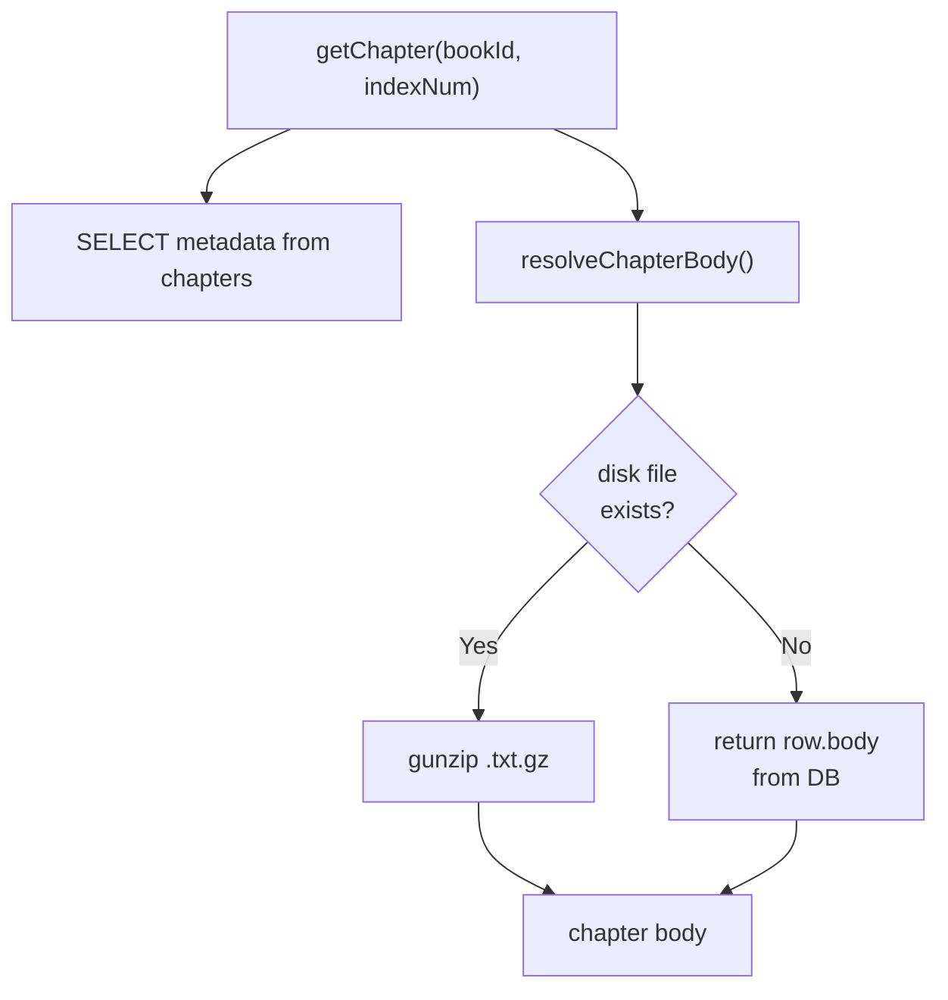
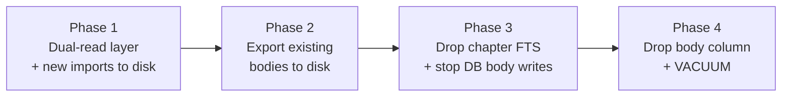

# Externalize Chapter Bodies (Incremental Migration)

## Current State

- **DB size**: 39 GB for 3,478 books / 1,482,830 chapters
- **Breakdown**: ~15 GB chapter body text + ~12 GB FTS5 index on chapters + ~8.7 GB freelist + rest metadata
- **chapter.body** is read in 2 places: the web reader (`getChapter`) and FTS chapter search (`searchChapters`)
- **EPUB converter** reads from `.txt` files on disk, never from the DB

## Key Design Principle: Dual-Read Layer

The website must work at all times during migration. A `resolveChapterBody()` function provides the bridge:

1. Try reading from disk (`data/compressed/{book_id}/{index}.txt.gz`)
2. If not found, fall back to `chapters.body` from the DB
3. This means old un-exported chapters (body in DB) and new/exported chapters (body on disk) both work seamlessly



## Migration Phases



Each phase is independently deployable. The website works correctly after each phase. You can pause between phases indefinitely.

---

## Phase 1 — Dual-Read Layer (zero-downtime deploy)

**Goal**: Website reads from disk when available, falls back to DB. New imports write to both.

### 1a. New utility — `src/lib/chapter-storage.ts`

Create a module with functions: `writeChapterBody`, `readChapterBody`, `resolveChapterBody`, `chapterFileExists`.

- `writeChapterBody(bookId, indexNum, body)` — gzip compress and write to `data/compressed/{bookId}/{indexNum}.txt.gz`
- `readChapterBody(bookId, indexNum)` — read and gunzip from disk, return null if file doesn't exist
- `resolveChapterBody(bookId, indexNum, dbBody)` — try disk first, fall back to `dbBody`
- `chapterFileExists(bookId, indexNum)` — check if gzip file exists

### 1b. Update chapter query — `src/lib/queries.ts`

Update `getChapter()` to use `resolveChapterBody` — still selects all columns (including `body`), but overrides body with disk version if available.

**No changes needed to any downstream consumers** — they all go through `getChapter()`:

- `src/app/doc-truyen/[slug]/[chapter]/page.tsx` — SSR reader page, passes `chapter.body` to `ChapterReader`
- `src/components/chapters/ChapterReader.tsx` — renders `chapter.body?.split("\n")` as paragraphs
- `src/app/api/books/by-slug/[slug]/chapters/[indexNum]/route.ts` — API route, returns `chapter.body` in JSON
- `vbook-extension/src/chap.js` — external client that fetches the above API; no changes needed

### 1c. Update import script — `scripts/import.ts`

After parsing the chapter `.txt`, write body to disk AND keep writing to DB (so FTS triggers still work). The `insertChapter` SQL statement stays unchanged. New imports populate both storage locations.

### 1d. Update Docker + env

Add `CHAPTERS_DIR=/app/data/compressed` env var to `docker-compose.yml` and `CHAPTERS_DIR=./data/compressed` to `.env.example`. The existing `./data:/app/data` volume mount already covers `data/compressed/`.

**After Phase 1**: Deploy and verify. The reader works exactly as before (disk files don't exist yet, so it falls back to DB body). New imports start populating disk. No downtime, no data migration yet.

---

## Phase 2 — Export Existing Bodies to Disk (run anytime, resumable)

**Goal**: Gradually move all 1.48M existing chapter bodies from DB to gzip files on disk.

### New script — `scripts/export-chapters.ts`

```
npx tsx scripts/export-chapters.ts              # export all, batch NULLing DB body
npx tsx scripts/export-chapters.ts --dry-run    # report what would be exported
npx tsx scripts/export-chapters.ts --keep-db    # write to disk but don't NULL db body
npx tsx scripts/export-chapters.ts --batch 5000 # custom batch size (default 1000)
npx tsx scripts/export-chapters.ts --quiet      # minimal output (for cron/scripts)
```

**Features**: cli-progress bar, per-batch log lines, boxed summary report, log file (`data/export-log.txt`), resumable (skips chapters already on disk).

**Core behavior:**

1. Count total: `SELECT COUNT(*) FROM chapters WHERE body IS NOT NULL`
2. Stream with `.iterate()`: `SELECT id, book_id, index_num, body FROM chapters WHERE body IS NOT NULL ORDER BY book_id, index_num`
3. For each row: skip if `.txt.gz` exists, write gzip, verify, accumulate id into batch buffer
4. After each batch of N rows (unless `--keep-db`), run `UPDATE chapters SET body = NULL WHERE id IN (...)`
5. Print summary report and append to log file

**After Phase 2**: All chapters exist on disk. DB body column is NULL for all rows. DB is still ~39 GB (freelist space not reclaimed yet), but the website reads entirely from disk.

---

## Phase 3 — Drop Chapter FTS + Stop DB Body Writes (optional, recommended)

**Goal**: Remove the ~12 GB FTS index on chapter bodies and stop writing body to DB.

### 3a. Remove chapter FTS

- `scripts/migrate.ts` — Remove `chapters_fts` creation and triggers. Add `DROP TABLE IF EXISTS chapters_fts` and `DROP TRIGGER IF EXISTS chapters_ai/ad/au`.
- `src/lib/queries.ts` — Remove `searchChapters()` function.
- `src/app/api/search/route.ts` — Remove `scope === "chapters"` branch.
- `src/app/tim-kiem/page.tsx` — Remove "Chương" tab, `chapterResults` query, chapter results section.
- `src/types/index.ts` — Remove `chapters` from `SearchResult` interface.

### 3b. Stop writing body to DB in import

- `scripts/import.ts` — Remove `body` from `insertChapter` SQL. Remove `DELETE FROM chapters_fts` from full-mode cleanup.

**After Phase 3**: FTS overhead is gone. The import only writes to disk. The `body` column still exists in the schema but is always NULL.

---

## Phase 4 — Drop Body Column + VACUUM (final cleanup)

**Goal**: Reclaim all disk space in the DB file.

### Drop body column

- `src/db/schema.ts` — Remove `body: text("body")` from the chapters table.
- Run `npm run db:generate` to create a Drizzle migration.
- `src/types/index.ts` — Add `ChapterWithBody = Chapter & { body: string | null }` type.
- `src/lib/queries.ts` — Update `getChapter` to return `ChapterWithBody`, use `readChapterBody` directly (no DB fallback).

### VACUUM

```bash
sqlite3 data/binslib.db "VACUUM;"
```

Reclaims all freed space. After VACUUM, the DB shrinks from ~39 GB to under 1 GB.

---

## Summary: What Works When

| State                | Reader                 | Chapter Search                          | New Imports                  |
| -------------------- | ---------------------- | --------------------------------------- | ---------------------------- |
| **Before migration** | body from DB           | chapters_fts                            | body to DB                   |
| **After Phase 1**    | disk or DB fallback    | chapters_fts (DB body)                  | body to disk + DB            |
| **After Phase 2**    | disk (DB body is NULL) | chapters_fts (degraded -- body is NULL) | body to disk + DB            |
| **After Phase 3**    | disk only              | removed                                 | body to disk only            |
| **After Phase 4**    | disk only              | removed                                 | body to disk only, DB < 1 GB |

## Storage Layout

```
data/
  binslib.db          (< 1 GB after Phase 4)
  compressed/
    100267/
      1.txt.gz
      2.txt.gz
      ...
    147360/
      1.txt.gz
      ...
```

## Risk Mitigation

- **No downtime**: Each phase is a normal deploy. The dual-read layer handles mixed state.
- **Rollback Phase 1**: Revert the code changes; DB body is untouched so everything works as before.
- **Rollback Phase 2**: If export is interrupted, re-run it (skips already-exported chapters). If you used `--keep-db`, DB body is still intact.
- **Rollback Phase 3**: Re-create chapters_fts and triggers. Since body column still exists (just NULL), you'd need to re-export from disk to DB if you want FTS back.
- **Phase 4 is irreversible**: Only do it after confirming everything works. The body column and its data are permanently gone.
- **Chapter search degradation**: Between Phase 2 (body NULLed) and Phase 3 (FTS dropped), chapter search returns no body snippets. This is acceptable since chapter search is a secondary feature accessed via an explicit tab switch.

## Verification Checklist (per phase)

All consumers of chapter body that must keep working:

| Consumer                                                | Type             | How it gets body                  | Needs code change?      |
| ------------------------------------------------------- | ---------------- | --------------------------------- | ----------------------- |
| `doc-truyen/[slug]/[chapter]/page.tsx`                  | SSR page         | `getChapter()` -> `ChapterReader` | No (uses `getChapter`)  |
| `ChapterReader.tsx`                                     | Client component | `chapter.body` prop               | No (receives from page) |
| `api/books/by-slug/[slug]/chapters/[indexNum]/route.ts` | API route        | `getChapter()` -> JSON `body`     | No (uses `getChapter`)  |
| `vbook-extension/src/chap.js`                           | External client  | Fetches the API above             | No (API is unchanged)   |
| `tim-kiem/page.tsx` (chapter tab)                       | Search page      | `searchChapters()` FTS            | Removed in Phase 3      |
| `api/search?scope=chapters`                             | Search API       | `searchChapters()` FTS            | Removed in Phase 3      |

Features unaffected by this migration (no body access):

- Book detail page, chapter list, chapter list modal (`getAllChapterTitles` — titles only)
- Book search (`books_fts` — unchanged)
- Author search, author pages (`searchAuthors`, `getLatestChaptersByAuthor` — no body)
- Rankings, genres, user bookmarks, reading progress
- EPUB generation (`epub-converter` — reads `.txt` files from crawler output, not DB)
- All `vbook-extension` pages except chapter reader (home, detail, toc, search — no body)
