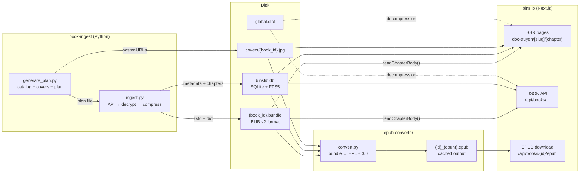

# Binslib

Next.js web reader for Vietnamese web novels. Serves a catalog, chapter reader, search, rankings, and on-demand EPUB downloads at [lib.binscode.site](https://lib.binscode.site). Exposes JSON APIs for the vBook Android extension.

Data is ingested by `book-ingest/` (separate subproject) which writes bundles and SQLite directly. Binslib is the **read layer** — it does not crawl, decrypt, or import.

## Stack

- Next.js 16 (App Router, SSR, Turbopack)
- SQLite + Drizzle ORM + FTS5 full-text search
- NextAuth.js v5 (credentials auth)
- Tailwind CSS 4
- zstd decompression for chapter storage (with global dictionary)
- On-demand EPUB generation from bundles (chapter-count cache)

## Setup

```bash
npm install
npm run db:migrate          # create tables + FTS5 indexes
npm run dev                 # http://localhost:3000
```

Data must be populated by `book-ingest/` before the reader has anything to serve:

```bash
cd ../book-ingest
pip install -r requirements.txt
python3 generate_plan.py                    # catalog → plan + covers
python3 ingest.py -w 5                      # download + decrypt + compress → bundles + DB
```

## Data Pipeline



Binslib is a pure reader — all writes happen in `book-ingest/` (bundles + SQLite) and `epub-converter/` (cached EPUBs). The Next.js runtime only reads bundles, decompresses chapters, and serves pages.

## Storage Layout

```
data/
  binslib.db                  # SQLite — metadata, chapter index, users, FTS5
  compressed/
    {book_id}.bundle          # per-book bundle: all chapters in one file
  epub/
    {id}_{count}.epub         # cached EPUBs (chapter-count-aware names)
  global.dict                 # zstd dictionary for decompression
```

Chapter bodies are stored in **per-book bundle files** on disk, not in the database. Each `.bundle` file contains a binary index + concatenated zstd-compressed chapter bodies, enabling O(1) random access to any chapter while keeping only one file per book. The `chapters` table in SQLite holds only metadata (title, slug, word count, book/index references). This keeps the DB small (< 1 GB) while supporting millions of chapters.

## Bundle Format (BLIB v2)

The `.bundle` binary format (BLIB, little-endian) has two versions. Readers accept both; new writes use v2.

### v1 header (12 bytes)

| Offset | Size | Field |
|--------|------|-------|
| 0 | 4 | Magic bytes `BLIB` |
| 4 | 4 | Version (uint32, `1`) |
| 8 | 4 | Entry count N (uint32) |

### v2 header (16 bytes)

| Offset | Size | Field |
|--------|------|-------|
| 0 | 4 | Magic bytes `BLIB` |
| 4 | 4 | Version (uint32, `2`) |
| 8 | 4 | Entry count N (uint32) |
| 12 | 2 | Meta entry size M (uint16, `256`) |
| 14 | 2 | Reserved (uint16, `0`) |

### Index entries (N × 16 bytes, both versions)

| Offset | Size | Field |
|--------|------|-------|
| 0 | 4 | Chapter index number (uint32) |
| 4 | 4 | Block offset from file start (uint32) |
| 8 | 4 | Compressed data length (uint32, excludes metadata prefix) |
| 12 | 4 | Uncompressed data length (uint32) |

### Chapter blocks

In **v1**, each block offset points directly to compressed data.

In **v2**, each block offset points to a fixed-size metadata prefix followed by compressed data:

```
[M bytes]             per-chapter metadata (256B, zero-padded)
[compressedLen bytes] zstd-compressed chapter text
```

The 256-byte metadata block layout:

| Offset | Size | Field |
|--------|------|-------|
| 0 | 4 | `chapter_id` (uint32, API ID, 0 = unknown) |
| 4 | 4 | `word_count` (uint32) |
| 8 | 1 | `title_len` (uint8, max 196) |
| 9 | 196 | `title` (UTF-8, zero-padded) |
| 205 | 1 | `slug_len` (uint8, max 48) |
| 206 | 48 | `slug` (UTF-8, zero-padded) |
| 254 | 2 | Reserved (zero) |

### Read paths

| Operation | v1 | v2 |
|-----------|----|----|
| Chapter data | `seek(offset)`, `read(compressedLen)` | `seek(offset + M)`, `read(compressedLen)` |
| Chapter meta | N/A | `seek(offset)`, `read(M)` |
| All indices | 12B header + N×16B index | 16B header + N×16B index |

The per-chapter metadata enables DB recovery from bundles alone — chapter titles, slugs, and word counts can be reconstructed by scanning the metadata blocks without decompressing any chapter bodies. The stored `chapter_id` enables O(missing) chapter walk resumption instead of O(total) linked-list traversal. Overhead: ~256 bytes per chapter (~512 KB for a 2000-chapter book, ~6% of a typical bundle).

### Legacy compatibility

The reader falls back to individual `.zst`/`.gz` files if no bundle exists for a book. Once all books are ingested via `book-ingest`, legacy per-file directories can be deleted.

---

## Chapter Storage Module

**File**: `src/lib/chapter-storage.ts`

The central read layer for chapter bodies on disk. The web reader and API routes go through this module.

### Public API

| Function | Description |
|---|---|
| `readChapterBody(bookId, index)` | Reads from bundle, falls back to legacy `.zst`/`.gz`. Returns `null` if not found |
| `writeChapterBody(bookId, index, body)` | Read-modify-write a single chapter into the book's bundle file |
| `listCompressedChapters(bookId)` | Returns sorted chapter indices from bundle + legacy files |
| `compressBody(body)` | Compress a string using the shared zstd compressor + dictionary |

### BundleWriter (batch API)

For writing many chapters at once (used by `book-ingest`), `BundleWriter` avoids O(N²) read-modify-write cycles:

```
import { BundleWriter } from "@/lib/chapter-storage";

const writer = new BundleWriter(bookId, { loadExisting: true });
writer.addChapter(1, bodyText1);
writer.addChapter(2, bodyText2);
writer.flush(); // writes a single .bundle file
```

The compressor/decompressor instances are lazily initialized singletons. If `data/global.dict` exists, it is loaded as a shared zstd dictionary for better compression ratios on small chapters. Bundle indexes are LRU-cached in memory for fast repeated reads.

---

## EPUB Generation

EPUBs are generated on demand by `epub-converter/convert.py`, which reads directly from bundles + SQLite (no `.txt` files needed). Results are cached in `data/epub/` with chapter-count-aware filenames:

```
data/epub/
  100358_5515.epub      # 5515 chapters at time of generation
  128390_1200.epub
```

**Cache logic**: if `{book_id}_{chapter_count}.epub` exists and the chapter count matches the current bundle, the cached file is served. When new chapters are ingested (chapter count increases), the next request triggers regeneration and deletes the stale cache entry.

Three API routes handle EPUB lifecycle:

| Route | Method | Purpose |
|---|---|---|
| `/api/books/{id}/download` | POST | Trigger generation if not cached; return `{ status: "ready", url }` |
| `/api/books/{id}/download-status` | GET | Check if cached EPUB exists and whether regeneration is needed |
| `/api/books/{id}/epub` | GET | Serve the cached EPUB file |

---

## Docker

```bash
docker compose up -d
```

The container runs the Next.js production server on port 8460. Data is mounted from the host:

```yaml
volumes:
  - ./data:/app/data              # SQLite DB, bundles, epub cache, dict
  - ./public/covers:/app/public/covers
  - ../epub-converter:/data/epub-converter
```

---

## npm Scripts

| Script | Description |
|---|---|
| `npm run dev` | Start dev server (Turbopack) |
| `npm run build` | Production build |
| `npm run start` | Start production server |
| `npm run lint` | Run ESLint |
| `npm run db:generate` | Generate Drizzle migrations |
| `npm run db:migrate` | Run migrations + create FTS5 tables |
| `npm run db:studio` | Open Drizzle Studio |

---

## Environment Variables

| Variable | Default | Description |
|---|---|---|
| `DATABASE_URL` | `file:./data/binslib.db` | SQLite database path |
| `CHAPTERS_DIR` | `./data/compressed` | Bundle files directory |
| `ZSTD_DICT_PATH` | `./data/global.dict` | Zstd dictionary for decompression |
| `EPUB_CACHE_DIR` | `./data/epub` | Cached EPUB output directory |
| `EPUB_CONVERTER_DIR` | `../epub-converter` | Path to epub-converter scripts |
| `NEXTAUTH_SECRET` | — | NextAuth.js session secret |
| `NEXTAUTH_URL` | — | Canonical URL for auth callbacks |