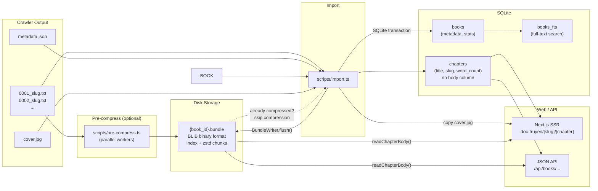
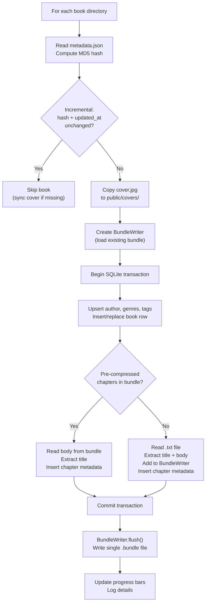

# Binslib

Next.js web reader and data pipeline for Vietnamese web novels. Imports crawled book data into SQLite, serves it through a web UI at [lib.binscode.site](https://lib.binscode.site), and exposes JSON APIs for the vBook Android extension.

## Stack

- Next.js 15 (App Router, SSR, Turbopack)
- SQLite + Drizzle ORM + FTS5 full-text search
- NextAuth.js v5 (credentials auth)
- Tailwind CSS 4
- zstd compression for chapter storage (with optional global dictionary)

## Setup

```bash
npm install
npm run db:migrate
npm run import:full      # import all crawler output
npm run dev              # http://localhost:3000
```

## Data Pipeline



The pipeline has two stages:

1. **Pre-compress** (optional) — compress crawler `.txt` files into `.bundle` files in parallel using worker threads. Useful when rsyncing compressed data to another machine before import.
2. **Import** — scan crawler output, read chapter text (from `.txt` files or pre-compressed bundles), write bundles to disk, insert metadata into SQLite.

### Storage layout

```
data/
  binslib.db                  # SQLite — metadata, chapter index, users, FTS
  compressed/
    {book_id}.bundle          # per-book bundle: all chapters in one file
  import-log.txt              # import run history
  pre-compress-log.txt        # pre-compress run history
  global.dict                 # optional zstd dictionary for better compression
```

Chapter bodies are stored in **per-book bundle files** on disk, not in the database. Each `.bundle` file contains a binary index + concatenated zstd-compressed chapter bodies, enabling O(1) random access to any chapter while keeping only one file per book. The `chapters` table in SQLite holds only metadata (title, slug, word count, book/index references). This keeps the DB small (< 1 GB) while supporting millions of chapters.

### Bundle format

The `.bundle` binary format (BLIB, little-endian) has two versions. Readers accept both; new writes use v2.

#### v1 header (12 bytes)

| Offset | Size | Field |
|--------|------|-------|
| 0 | 4 | Magic bytes `BLIB` |
| 4 | 4 | Version (uint32, `1`) |
| 8 | 4 | Entry count N (uint32) |

#### v2 header (16 bytes)

| Offset | Size | Field |
|--------|------|-------|
| 0 | 4 | Magic bytes `BLIB` |
| 4 | 4 | Version (uint32, `2`) |
| 8 | 4 | Entry count N (uint32) |
| 12 | 2 | Meta entry size M (uint16, `256`) |
| 14 | 2 | Reserved (uint16, `0`) |

#### Index entries (N × 16 bytes, both versions)

| Offset | Size | Field |
|--------|------|-------|
| 0 | 4 | Chapter index number (uint32) |
| 4 | 4 | Block offset from file start (uint32) |
| 8 | 4 | Compressed data length (uint32, excludes metadata prefix) |
| 12 | 4 | Uncompressed data length (uint32) |

#### Chapter blocks

In **v1**, each block offset points directly to compressed data:

```
[compressedLen bytes] zstd-compressed chapter text
```

In **v2**, each block offset points to a fixed-size metadata prefix followed by compressed data:

```
[M bytes]             per-chapter metadata (256B, zero-padded)
[compressedLen bytes] zstd-compressed chapter text
```

The 256-byte metadata block layout:

| Offset | Size | Field |
|--------|------|-------|
| 0 | 4 | `chapter_id` (uint32, API ID, 0 = unknown) |
| 4 | 4 | `word_count` (uint32) |
| 8 | 1 | `title_len` (uint8, max 196) |
| 9 | 196 | `title` (UTF-8, zero-padded) |
| 205 | 1 | `slug_len` (uint8, max 48) |
| 206 | 48 | `slug` (UTF-8, zero-padded) |
| 254 | 2 | Reserved (zero) |

#### Read paths

| Operation | v1 | v2 |
|-----------|----|----|
| Chapter data | `seek(offset)`, `read(compressedLen)` | `seek(offset + M)`, `read(compressedLen)` |
| Chapter meta | N/A | `seek(offset)`, `read(M)` |
| All indices | 12B header + N×16B index | 16B header + N×16B index |

The per-chapter metadata enables DB recovery from bundles alone (if the SQLite DB is lost, chapter titles/slugs/word counts can be reconstructed by scanning the metadata blocks). The stored `chapter_id` also enables O(missing) chapter walk resumption instead of O(total) linked-list traversal. The overhead is 256 bytes per chapter (~512KB for a 2000-chapter book, ~6% of a typical bundle).

This reduces file count from millions of individual `.zst` files to one `.bundle` per book, eliminating filesystem overhead and dramatically improving I/O performance on both NTFS and ext4.

### Legacy compatibility

The reader falls back to individual `.zst`/`.gz` files if no bundle exists for a book. This allows a gradual transition — once all books are re-imported, legacy per-file directories can be deleted.

---

## Pre-compress (optional)

**Script**: `scripts/pre-compress.ts`

Reads `.txt` chapter files directly from crawler output directories and compresses them into per-book `.bundle` files using parallel worker threads. This is useful for pre-compressing on a build machine before rsyncing bundles to production — the import script will detect pre-compressed bundles and skip compression for those books.

```bash
# Pre-compress with auto-detected worker count (= CPU cores)
npm run pre-compress
npx tsx scripts/pre-compress.ts

# Custom worker count
npx tsx scripts/pre-compress.ts --workers 6

# Preview
npx tsx scripts/pre-compress.ts --dry-run
```

**How it works:**

1. Scans both `crawler/output/` and `crawler-tangthuvien/output/` for book directories
2. Estimates chapter counts from `metadata.json` (avoids expensive directory enumeration)
3. Splits work across N worker threads (contiguous ranges for sequential disk access)
4. Each worker uses a 3-tier skip strategy per book:
   - **Tier 1 — mtime fast skip**: compares bundle file mtime vs source directory mtime (2 stat calls, no file reads). If the directory hasn't changed since the bundle was written, skip instantly
   - **Tier 2 — index-only check**: reads only the bundle header + index section (~16KB for 1000 chapters instead of the full multi-MB file) to get existing chapter indices, then runs `readdirSync` to find new `.txt` files
   - **Tier 3 — full merge**: only when new chapters are found, reads the full bundle data, compresses new chapters with zstd, and writes a merged bundle
5. Gap validation: new chapter indices must be contiguous from the bundle's highest existing index
6. Reports compression ratio, throughput, and per-worker stats

---

## Import

**Script**: `scripts/import.ts`

Scans crawler output directories and loads book data into SQLite. Each book folder is expected to follow the shared crawler output format:

```
crawler/output/{book_id}/
  metadata.json           # book metadata (name, author, genres, chapter_count, etc.)
  cover.jpg               # cover image
  0001_chapter-slug.txt   # chapter files: {4-digit index}_{slug}.txt
  0002_chapter-slug.txt
  ...
```

### What the import does



For each book directory (scanned from both `crawler/output/` and `crawler-tangthuvien/output/`):

1. **Estimates chapter counts** from `metadata.json` (no directory enumeration needed)
2. **Reads `metadata.json`** — if missing, tries to fetch it by running `meta-puller/pull_metadata.py`
3. **Computes a metadata hash** (MD5) for change detection in incremental mode
4. **Incremental skip logic** — in default mode, skips books where both the metadata hash and `updated_at` timestamp are unchanged, and the DB already has all chapters from `metadata.json`
5. **Copies `cover.jpg`** to `public/covers/{book_id}.jpg` for serving by Next.js
6. **Creates a `BundleWriter`** that loads any existing bundle data for the book, so new chapters are merged with existing ones
7. **Imports in a single SQLite transaction** per book:
   - Upserts author, genres (auto-assigns IDs for TTV genres without numeric IDs), and tags
   - Inserts or replaces the book row with all metadata fields and a `source` column (`mtc` or `ttv`)
   - For pre-compressed chapters (already in a bundle, no `.txt` source): extracts title from body, inserts metadata row
   - For each chapter `.txt` file: extracts title, strips leading blanks, adds body to the `BundleWriter`, inserts metadata row
8. **Flushes the `BundleWriter`** after the DB transaction commits — writes a single `.bundle` file per book instead of thousands of individual `.zst` files
9. **Prints a boxed report** with counts of scanned/imported/skipped/failed books, chapters added, covers copied, and DB size

### Import modes

```bash
# Incremental (default) — only imports new or changed books
npm run import
npx tsx scripts/import.ts

# Full re-import — clears all data and re-imports everything
npm run import:full
npx tsx scripts/import.ts --full

# Cron daemon — polls for new data on an interval
npm run import:cron
npx tsx scripts/import.ts --cron --interval 10   # every 10 minutes (default: 30)

# Target specific books
npx tsx scripts/import.ts --ids 100267 102205

# Dry run — reports what would be imported without making changes
npx tsx scripts/import.ts --dry-run

# Quiet — suppresses progress bars (for scripts/CI)
npx tsx scripts/import.ts --quiet
```

### Environment variables

| Variable | Default | Description |
|---|---|---|
| `DATABASE_URL` | `file:./data/binslib.db` | SQLite database path |
| `CRAWLER_OUTPUT_DIR` | `../crawler/output` | MTC crawler output directory |
| `TTV_CRAWLER_OUTPUT_DIR` | `../crawler-tangthuvien/output` | TTV crawler output directory |
| `META_PULLER_DIR` | `../meta-puller` | Path to meta-puller scripts |
| `CHAPTERS_DIR` | `./data/compressed` | Where bundle files are stored |
| `ZSTD_DICT_PATH` | `./data/global.dict` | Optional zstd dictionary for compression |

---

## Chapter Storage Module

**File**: `src/lib/chapter-storage.ts`

The central read/write layer for chapter bodies on disk. All scripts and the web reader go through this module.

### Public API

| Function | Description |
|---|---|
| `readChapterBody(bookId, index)` | Reads from bundle, falls back to legacy `.zst`/`.gz`. Returns `null` if not found |
| `writeChapterBody(bookId, index, body)` | Read-modify-write a single chapter into the book's bundle file |
| `listCompressedChapters(bookId)` | Returns sorted chapter indices from bundle + legacy files |
| `compressBody(body)` | Compress a string using the shared zstd compressor + dictionary |

### BundleWriter (batch API)

For importing many chapters at once, use `BundleWriter` instead of calling `writeChapterBody()` per chapter (which would do O(N²) read-modify-write cycles):

```
import { BundleWriter } from "@/lib/chapter-storage";

const writer = new BundleWriter(bookId, { loadExisting: true });
writer.addChapter(1, bodyText1);
writer.addChapter(2, bodyText2);
writer.flush(); // writes a single .bundle file
```

The compressor/decompressor instances are lazily initialized singletons. If `data/global.dict` exists, it is loaded as a shared zstd dictionary for better compression ratios on small chapters. Bundle indexes are LRU-cached in memory for fast repeated reads.

## Docker

```bash
docker compose up -d
```

The `docker-compose.yml` mounts crawler output directories, meta-puller, epub-converter, and the `data/` volume. The container runs the Next.js production server on port 8460.

## npm Scripts

| Script | Description |
|---|---|
| `npm run dev` | Start dev server (Turbopack) |
| `npm run build` | Production build |
| `npm run start` | Start production server |
| `npm run db:generate` | Generate Drizzle migrations |
| `npm run db:migrate` | Run migrations + create FTS tables |
| `npm run pre-compress` | Pre-compress crawler .txt files into bundles (parallel) |
| `npm run import` | Incremental import |
| `npm run import:full` | Full re-import (clears existing data) |
| `npm run import:cron` | Import daemon (polls every 30 min) |