# crawler-descryptor

Decrypt chapter content from the metruyencv mobile API without needing the Android emulator.

## Status: SOLVED

The encryption has been fully reverse-engineered. No external key, Frida hooks, or emulator is needed — the AES key is embedded in every API response and extracted automatically.

Validated: decrypted output matches the production crawler's database plaintext character-for-character.

---

## Decryption Algorithm

### Overview

The mobile API (`android.lonoapp.net/api/chapters/{id}`) returns a `content` field that is a **modified base64 string**. The server injects 16 characters of key material into the base64 at a fixed position. The app extracts these characters, removes them to recover clean base64, then decrypts the payload.

**Cipher**: AES-128-CBC with PKCS7 padding, wrapped in a Laravel encryption envelope.

### Step-by-step

Given the raw `content` string from the API response:

```
eyJpdiI6IkVlN21ta2UFvSV5Q5aej6kVRk94RFUyWm5MMWFjQW91OFE9PSIsInZhbH...
^                ^               ^
0               17              33
```

#### Step 1 — Extract the AES key

Characters at positions **[17:33]** (16 chars) are the AES-128 encryption key:

```python
key_chars = content[17:33]          # e.g. "2UFvSV5Q5aej6kVR"
key_bytes = bytes(ord(c) for c in key_chars)  # 16 bytes
```

These are ASCII printable characters. Their byte values (code units) are used directly as the 16-byte AES key. A new random key is generated by the server for every response.

#### Step 2 — Remove key chars to recover clean base64

```python
clean_b64 = content.replace(key_chars, "", 1)
```

The first occurrence of those 16 characters is removed. What remains is a valid base64 string.

#### Step 3 — Decode the Laravel encryption envelope

```python
raw_bytes = base64.b64decode(clean_b64)
envelope_str = raw_bytes.decode("utf-8")
envelope = json.loads(envelope_str)
# envelope = {"iv": "<base64>", "value": "<base64>", "mac": "<hex>"}
```

The clean base64 decodes to a UTF-8 JSON string containing three fields:

| Field   | Format        | Description                           |
| ------- | ------------- | ------------------------------------- |
| `iv`    | base64 string | 16-byte AES initialization vector     |
| `value` | base64 string | AES-128-CBC ciphertext (PKCS7 padded) |
| `mac`   | 64-char hex   | HMAC-SHA256 integrity digest          |

#### Step 4 — Decode the IV and ciphertext

```python
iv = base64.b64decode(envelope["iv"])           # 16 bytes
ciphertext = base64.b64decode(envelope["value"]) # N * 16 bytes
```

The IV in the clean envelope is a standard base64 string — no obfuscation. (The "corrupted IV" observed in earlier analysis was caused by decoding the content _without_ removing the injected key chars first.)

#### Step 5 — Decrypt with AES-128-CBC

```python
from Crypto.Cipher import AES
from Crypto.Util.Padding import unpad

cipher = AES.new(key_bytes, AES.MODE_CBC, iv)
plaintext = unpad(cipher.decrypt(ciphertext), AES.block_size)
text = plaintext.decode("utf-8").strip()
```

The result is the chapter's plain text content in Vietnamese.

### Visual diagram

```
API Response content field:
┌─────────────────┬────────────────┬──────────────────────────────────────────┐
│  base64 prefix  │  16-char KEY   │  base64 continuation                     │
│  content[0:17]  │ content[17:33] │  content[33:]                            │
└─────────────────┴────────────────┴──────────────────────────────────────────┘
                  ↓ extract        ↓ remove key, rejoin
            AES-128 key      clean base64 string
                                   ↓ base64 decode + UTF-8 + JSON parse
                             ┌─────────────────────────────────┐
                             │ { "iv": "...",                  │
                             │   "value": "...",               │
                             │   "mac": "..." }                │
                             └─────────────────────────────────┘
                                   ↓ base64 decode iv & value
                             AES-128-CBC decrypt(key, iv, value)
                                   ↓ PKCS7 unpad + UTF-8
                             "Chương 1: Tiêu Phàm trọng sinh..."
```

### Key properties

- **Key per response**: The server generates a new random 16-byte key for every API call. Even requesting the same chapter twice yields different keys and ciphertexts.
- **Key transport**: The key is embedded directly in the content string, making the encryption an obfuscation scheme rather than true secret-key cryptography.
- **No external key needed**: Unlike a typical AES setup, there is no shared secret — the key travels with the ciphertext.

---

## How It Was Discovered

The algorithm was reverse-engineered through **static analysis** of the Flutter/Dart AOT binary:

1. **blutter** (Dart AOT decompiler) was run on `libapp.so` + `libflutter.so` from the APK
2. The decompiled assembly of `_getChapterDetailsEncrypt` in `novelfever/utils/api_client.dart` revealed:
   - `content.substring(17, 33)` — extract 16 characters at positions 17-32
   - `content.replaceAll(substring, "")` — remove them from the content
   - `base64.decode → utf8.decode → jsonDecode` — parse the clean envelope
   - `Uint8List.fromList(substring.codeUnits)` — convert chars to key bytes
   - `aesSetKeys(keyBytes, base64.decode(envelope["iv"]))` — set AES-128 key + IV
   - `aesDecrypt(base64.decode(envelope["value"]))` — decrypt the ciphertext
3. The `aes_crypt_null_safe` Dart package was identified as the crypto library
4. ARM64 instruction `mov x16, #0x42` (66) was identified as a **Smi-encoded** value (66 >> 1 = 33), resolving the `substring(17, 33)` end index

Previous approaches (Frida runtime hooking, exhaustive binary scanning, memory dumps) were unsuccessful because the key is not static — it changes with every API response.

---

## Crawler Flow

### Architecture

```mermaid
flowchart LR
    subgraph SCRIPTS["📜 Download Scripts"]
        main["main.py<br/><i>single book</i>"]
        batch["download_batch.py<br/><i>specific IDs</i>"]
        topN["download_topN.py<br/><i>plan files, N workers</i>"]
    end

    subgraph CLIENT["🔌 src/"]
        api_client["client.py — APIClient<br/>• get_book(id)<br/>• get_chapter(id)<br/>• iter_chapters(first_id)"]
        async_dl["downloader.py — AsyncBookClient<br/>• download_book(client, entry, label)"]
    end

    subgraph API["🌐 android api"]
        books_api["/api/books/{id}<br/><i>metadata + first_chapter</i>"]
        chapters_api["/api/chapters/{id}<br/><i>encrypted content + next link</i>"]
    end

    subgraph DECRYPT["🔓 src/decrypt.py"]
        decrypt_fn["decrypt_content()<br/>1. Extract key [17:33]<br/>2. Remove key → clean base64<br/>3. Decode JSON envelope<br/>4. AES-128-CBC decrypt<br/>5. Return plaintext"]
    end

    subgraph UTILS["💾 src/utils.py"]
        save["save_chapter() → .txt<br/>save_metadata() → .json"]
    end

    subgraph OUTPUT["📁 output"]
        files["0001_slug.txt<br/>0002_slug.txt<br/>metadata.json"]
    end

    main --> api_client
    batch --> async_dl
    topN --> async_dl
    async_dl --> api_client

    api_client --> books_api
    api_client --> chapters_api

    chapters_api -->|"encrypted content"| decrypt_fn
    decrypt_fn -->|"plaintext"| save
    save --> files

    style SCRIPTS fill:#e0f2fe,stroke:#0284c7
    style CLIENT fill:#fef3c7,stroke:#f59e0b
    style API fill:#fee2e2,stroke:#ef4444
    style DECRYPT fill:#d1fae5,stroke:#10b981
    style UTILS fill:#ede9fe,stroke:#8b5cf6
    style OUTPUT fill:#f3f4f6,stroke:#6b7280
```



### Download Process (download_topN.py)

```mermaid
flowchart LR
    START([Start]) --> LOAD

    subgraph LOAD["1️⃣ Load Plan"]
        load_json["Read JSON plan file"]
        filter["Apply --exclude, --offset, --limit"]
        queue["Build work queue"]
        load_json --> filter --> queue
    end

    LOAD --> SPAWN

    subgraph SPAWN["2️⃣ Spawn Workers"]
        workers["Create N async workers<br/>(default: 200)"]
    end

    SPAWN --> WORKER

    subgraph WORKER["3️⃣ Per-Book Workflow"]
        direction TB

        subgraph META["Get Metadata"]
            fetch_book["GET /api/books/{id}"]
            extract["Extract: name, chapter_count, first_chapter"]
            save_meta["Save metadata.json"]
            fetch_book --> extract --> save_meta
        end

        subgraph CHECK["Check Existing"]
            scan["Scan output/{book_id}/*.txt"]
            parse["Parse chapter indices"]
            skip_check{"All complete?"}
            scan --> parse --> skip_check
        end

        subgraph DOWNLOAD["Download Chapters"]
            fetch_ch["GET /api/chapters/{id}"]
            decrypt["Decrypt content"]
            save_ch["Save {index}_{slug}.txt"]
            get_next["Get next.id"]
            more{"More chapters?"}

            fetch_ch --> decrypt --> save_ch --> get_next --> more
            more -->|"Yes"| fetch_ch
        end

        META --> CHECK
        skip_check -->|"No"| DOWNLOAD
        skip_check -->|"Yes, skip"| DONE2
    end

    WORKER --> SUMMARY

    subgraph SUMMARY["4️⃣ Summary"]
        report["Report: books, chapters saved, errors"]
    end

    more -->|"No"| DONE2([Done])
    SUMMARY --> END([End])

    style LOAD fill:#dbeafe,stroke:#3b82f6
    style SPAWN fill:#fef3c7,stroke:#f59e0b
    style WORKER fill:#f0fdf4,stroke:#22c55e
    style META fill:#ecfdf5,stroke:#10b981
    style CHECK fill:#fefce8,stroke:#eab308
    style DOWNLOAD fill:#fdf2f8,stroke:#ec4899
    style SUMMARY fill:#f3e8ff,stroke:#a855f7
```



### Chapter Linked-List Navigation

The API uses a **linked list** structure for chapters:


The crawler starts from `first_chapter` (from book metadata) and follows `next.id` links until:

- `next` is null (end of book)
- Chapter count reached
- Network error occurs

---

## Setup

```bash
cd crawler-descryptor
pip install -r requirements.txt
```

## Usage

### Decrypt a single chapter

```bash
python3 main.py fetch-chapter 10340503
```

### Fetch all chapters of a book

```bash
python3 main.py fetch-book 100358
```

### Batch download specific books

```bash
python3 download_batch.py                     # download preset list
python3 download_batch.py 100441 101481 101486  # specific book IDs
python3 download_batch.py -w 15 --clean       # 15 workers, clean wrong data first
```

### Download from plan file

```bash
python3 download_topN.py 1000                           # top 1000 from default plan
python3 download_topN.py 500 -w 200                     # top 500, 200 parallel workers
python3 download_topN.py 2000 --plan custom.json        # top 2000 from custom plan file
python3 download_topN.py 1000 --offset 500              # skip first 500, then take 1000
python3 download_topN.py 1000 --exclude 100441 101481   # skip specific IDs
```

### Fetch full platform catalog

```bash
python3 fetch_catalog.py                # fetch all 30,486 books, audit vs local DB
python3 fetch_catalog.py --verify 926   # verify author ID 926 has expected books
python3 fetch_catalog.py --skip-fetch   # reuse existing full_catalog.json, just re-audit
```

### Download the full catalog (all missing books)

```bash
python3 download_topN.py -w 200 --plan books_plan_mtc.json          # 24,235 books (≥80 chapters)
python3 download_topN.py -w 200 --plan new_books_download.json      # 24,440 new books
python3 download_topN.py -w 200 --plan partial_books_download.json  # 357 partial books
```

### Analyze encryption details

```bash
python3 main.py analyze 10340503
```

### Output

Chapters are saved to `crawler/output/{book_id}/` in the same format as the existing crawler:

```
crawler/output/{book_id}/
├── 0001_chapter-slug.txt    # temporary — cleaned up after import
├── 0002_chapter-slug.txt
├── ...
└── metadata.json            # kept permanently
```

After downloading, run `binslib/scripts/import.ts --cleanup` to import chapters
into the SQLite database and remove the `.txt` files. The epub-converter and
binslib website will then read chapters from the database.

## Download Plan Files

| File                          | Books  | Description                                                             |
| ----------------------------- | ------ | ----------------------------------------------------------------------- |
| `full_catalog.json`           | 30,486 | Complete platform catalog from API                                      |
| `books_plan_mtc.json`         | 24,235 | Filtered list (≥80 chapters), sorted by chapter count (renamed from `fresh_books_download.json`) |
| `new_books_download.json`     | 24,440 | Books not yet in local database                                         |
| `partial_books_download.json` | 357    | Books with incomplete downloads (has `db_chapters` and `gap` fields)    |
| `audit_result.json`           | —      | Latest audit comparing local DB vs API (complete/partial/missing stats) |

All plan files use the same book entry format:

```json
{
  "id": 100890,
  "name": "Hương Thôn Thấu Thị Thần Y",
  "slug": "huong-thon-thau-thi-than-y",
  "chapter_count": 2990,
  "first_chapter": 11063426,
  "status": "Hoàn thành",
  "kind": 1,
  "sex": 1,
  "word_count": 7807531
}
```

Partial books include additional tracking fields: `db_chapters` (chapters on disk) and `gap` (remaining to download).

## Project Structure

```
crawler-descryptor/
├── README.md                      # This file
├── API.md                         # MTC mobile API endpoint documentation
├── ENCRYPTION.md                  # Detailed encryption analysis notes
├── KNOWLEDGE.md                   # Reverse engineering knowledge base
├── PLAN.md                        # Original investigation plan (historical)
├── requirements.txt
│
├── main.py                        # CLI: fetch-chapter, fetch-book, analyze
├── download_batch.py              # Parallel batch download (specific book IDs)
├── download_topN.py               # Parallel download from plan JSON files (top N books)
├── fetch_catalog.py               # Full platform catalog fetcher + audit
├── collect_samples.py             # Collect encrypted/decrypted pairs for testing
│
├── src/
│   ├── downloader.py              # Shared async download engine (AsyncBookClient, download_book)
│   ├── decrypt.py                 # AES-128-CBC decryption + key extraction
│   ├── client.py                  # Sync API client (chapter fetching, book lookup)
│   ├── iv_extract.py              # IV de-obfuscation strategies (historical)
│   └── utils.py                   # Output formatting, file helpers, bundle-aware chapter counting
│
├── full_catalog.json              # Complete platform catalog: 30,486 books
├── books_plan_mtc.json            # 24,235 books to download (≥80 chapters, renamed from fresh_books_download.json)
├── new_books_download.json        # 24,440 new books not yet downloaded
├── partial_books_download.json    # 357 partially downloaded books
├── audit_result.json              # Latest audit results vs local DB
├── books_to_download.json         # Structured download plan (need_download/partial)
├── full_download_plan.json        # Full download plan with categories
├── top1000_download_plan.json     # Top 1000 download plan (historical)
│
├── frida/                         # Historical — Frida hooks (no longer needed)
│   ├── hook_boringssl.js
│   ├── hook_dart_decrypt.js
│   ├── hook_api_init.js
│   └── gadget-config.json
│
└── tests/
    ├── test_blutter_decrypt.py    # Decryption validation test
    ├── test_decrypt.py            # Test against sample pairs
    ├── test_validate_vs_crawler.py  # Compare output with crawler DB
    └── samples/
        ├── verified_pair.json     # Known plaintext-ciphertext pair
        ├── raw_response_*.json    # Raw API responses for debugging
        └── frida_*.json/log       # Frida capture data (historical)
```
